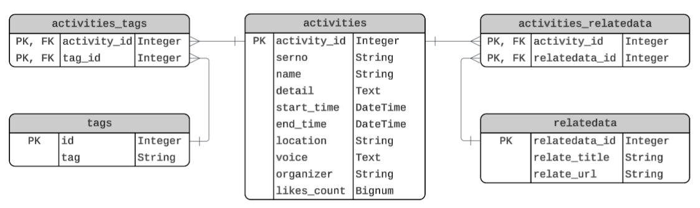
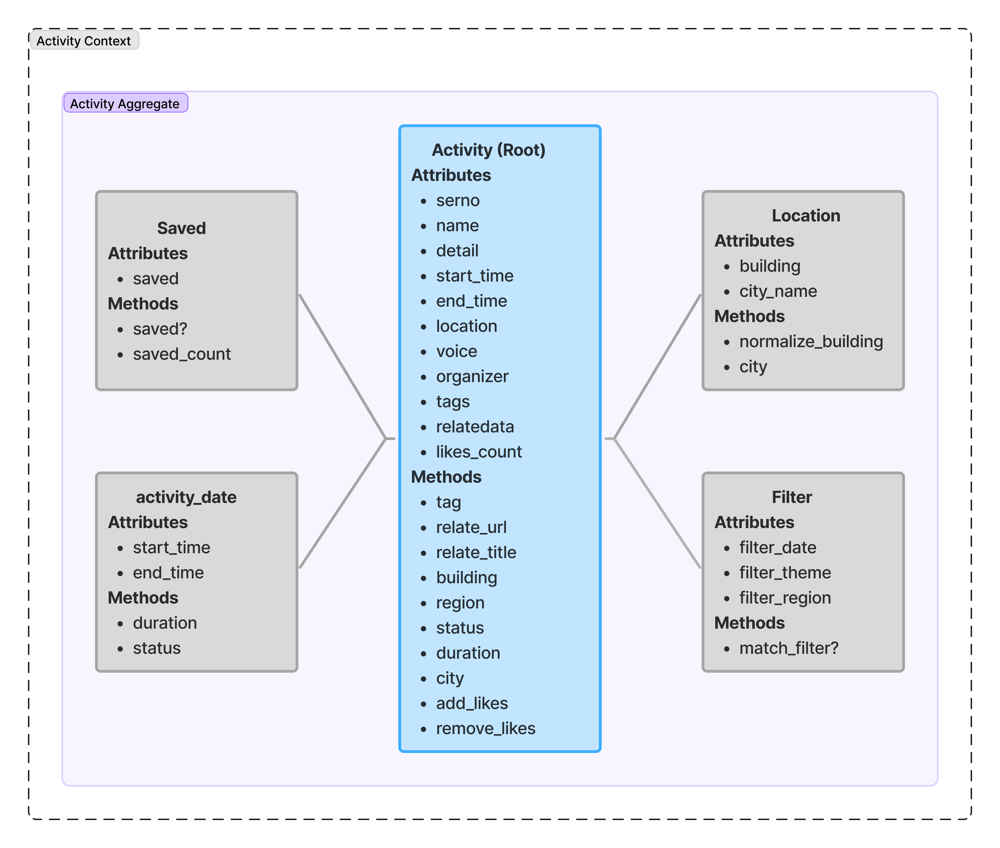
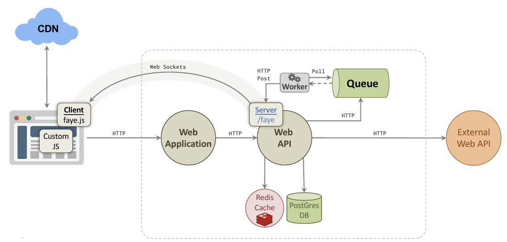
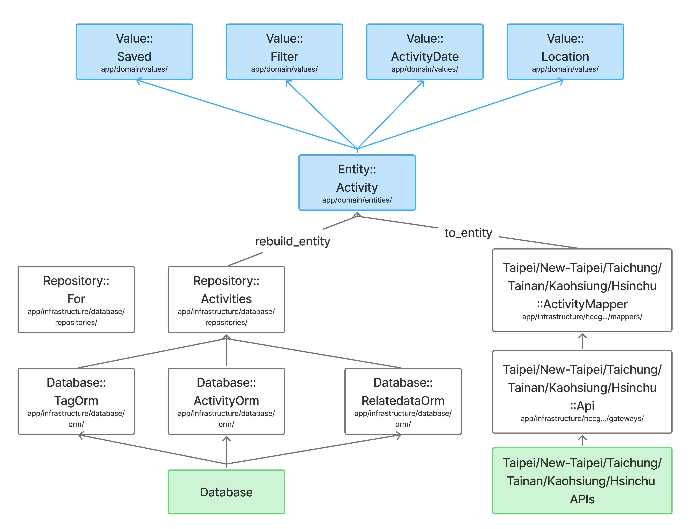

# Eventure

## Motivation

Many people want to go out and have fun but spend too much time swiping through various apps to search for activities in Taiwan. Moreover, when they want to find events in different parts of Taiwan, they have to visit each city's official website separately. Therefore, we aim to create a web application that helps users easily discover activities happening across multiple cities.

## App Features

Our application provides a **one-stop event discovery platform** that helps users easily find activities they are interested in. Instead of visiting multiple sources, users can search for activities through a unified interface. The main features include:

1. Allowing users to apply filters such as **date**, **tag**, and **region** to quickly find relevant activities.

2. Providing a **like** feature that allows users to express interest in activities. The system displays each activity's popularity based on the total number of likes. Users can also view their liked activities on the Liked Activities page.

3. Allowing users to switch the application language using a button.

## Data Sources

We collect data from the open APIs of the following six cities and store them in the database according to the ERD shown below:

| City | API URL |
| :--: | :-- |
| Taipei City | [https://www.travel.taipei/open-api/zh-tw/Events/Calendar?top=20](https://www.travel.taipei/open-api/zh-tw/Events/Calendar?top=20) |
| New Taipei City | [https://data.ntpc.gov.tw/api/datasets/029e3fc2-1927-4534-8702-da7323be969b/json?page=0&size=20](https://data.ntpc.gov.tw/api/datasets/029e3fc2-1927-4534-8702-da7323be969b/json?page=0&size=20) |
| Hsinchu City | [https://webopenapi.hccg.gov.tw/v1/Activity?top=20](https://webopenapi.hccg.gov.tw/v1/Activity?top=20) |
| Taichung City | [https://datacenter.taichung.gov.tw/swagger/OpenData/4c5157cc-34ed-45fb-ba03-34e6cbbfc9d8](https://datacenter.taichung.gov.tw/swagger/OpenData/4c5157cc-34ed-45fb-ba03-34e6cbbfc9d8) |
| Tainan City | [https://soa.tainan.gov.tw/Api/Service/Get/d6fc3d1b-4b5b-4205-9014-5118e37f0971](https://soa.tainan.gov.tw/Api/Service/Get/d6fc3d1b-4b5b-4205-9014-5118e37f0971) |
| Kaohsiung City | [https://data.kcg.gov.tw/Json/Get/80bbbbd3-9ee4-4244-98e9-b4c08deda91b](https://data.kcg.gov.tw/Json/Get/80bbbbd3-9ee4-4244-98e9-b4c08deda91b) |

  

## Domain-Driven Design

### Domain Model

  

### Service Objects

| Class | Description |
| :--: | :-- |
| `SearchedActivities` | Allows users to search for activities using keywords from the search bar. |
| `FilteredActivities` | Filters activities based on criteria such as tag, city, start time, and end time, and returns the matched activities. |
| `UpdateLikeCounts` | Updates the like counts for each activity in the database. |
| `ListActivity` | Retrieves all activities. |
| `ListCity` | Retrieves the list of cities for filtering. |
| `ListTag` | Retrieves the list of tags for filtering. |
| `ApiActivities` | Fetches data from external APIs and stores it in the database. |
| `Translation` | Translates the website content into English. |

## Business Logic

1. Instead of using the original tags provided by the APIs, we generate new tags using the Gemini API based on the activity content.

2. In addition to displaying each activity's start and end time, we assign a status (Archived, Expired, Ongoing, Upcoming, or Scheduled) based on these timestamps. This status helps users understand whether an activity has ended or is upcoming, and it also allows the system to control which activities should be displayed or stored in the database.

## System Architecture

   
  <em>The image is modified from lecture notes by Soumya Ray</em>

### Data Flow

* The Web API sends HTTP requests to fetch data from external APIs and stores the activity information in the database (`.db` files for development and PostgreSQL for production).

* The Web App sends HTTP requests to the Web API to retrieve data.

### Caching

* Reverse-proxy caching: The Web API caches requests and responses from the Web App.
* Browser caching: The browser caches responses from the Web App.

### Background Workers

Since fetching data from external APIs is a long-running task, we use background workers to handle this process. We use **Shoryuken** (a SQS-based worker library) to process fetch requests asynchronously and report progress using the **FAYE** gem.

## Code Architecture

  

## Next Steps

1. Introduce activity data from more cities to enrich the system.

2. Allow users to filter activities not only by city but also by district.

3. Enable filtering by multiple conditions, such as showing art-related activities in Taichung City between 2026/01/01 and 2026/01/31.

4. Remove Archived activities from filter results while keeping the data in the database for future recommendations.

5. Display activities in descending order of like counts to reflect overall popularity.

6. Track users' locations and recommend nearby activities.

7. Recommend activities based on users' previously liked or saved activities.

## User Instructions

Since the application is divided into API and App components, please complete all of the following steps.

### I. Run Eventure-App

1. Clone the [Eventure-App](https://github.com/AMaLina-1/Eventure-APP) project from GitHub.

2. Run `bundle install` to install all required gems.

3. Run `rake new_session_secret` to generate a secret, then fill it into `config/secrets_sample.yml` and rename the file to `config/secrets.yml`.

4. Start the application by running `rake run`.

### II. Run Eventure-API

1. Clone the [Eventure-API](https://github.com/AMaLina-1/Eventure-API) project from GitHub.

2. Run `bundle install` to install all required gems.

3. Register accounts on Redis Cloud and AWS, then create an SQS queue. Fill in the Redis Cloud credentials, AWS credentials, and SQS configuration in `config/secrets_sample.yml`, and rename it to `config/secrets.yml`.

4. Create the database by running `rake db:migrate`.

5. Start the background worker by running `rake worker:run:dev`.

6. Start the API server by running `rake run`.

